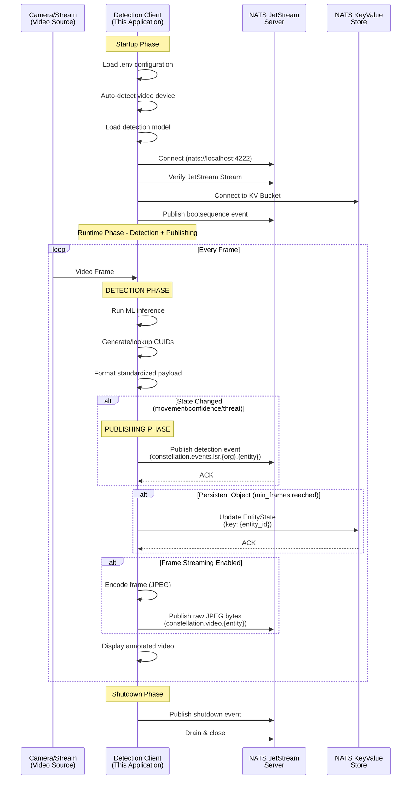

<p align="center">
  
  <h1 align="center">vision2constellation</h1>
</p>

<p align="center">
  Real-time video edge inference system with modular ML detection for the Constellation Overwatch platform.
</p>

<p align="center">
  <a title="Python Version" target="_blank" href="https://www.python.org/"></a>
  <a title="License" target="_blank" href="https://github.com/Constellation-Overwatch/vision2constellation/blob/main/LICENSE"></a>
</p>

---

## About

`vision2constellation` is a specialized edge service designed to perform real-time object detection from video streams (cameras, RTSP, HTTP) and bridge detection events to the Constellation Overwatch NATS JetStream mesh. It supports multiple ML models including YOLOE C4ISR threat detection, RT-DETR, SAM2 segmentation, and Moondream vision-language models.

> **⚠️ Warning:** This software is under active development and only tested on macOS. While functional, it may contain bugs and undergo breaking changes. Use caution with production deployments.

## Features

* **Multi-Model Detection**: Supports YOLOE C4ISR (default), RT-DETR, YOLOE, SAM2, and Moondream models.
* **NATS JetStream Bridge**: Seamlessly bridges detection events to NATS subjects.
* **Video Frame Streaming**: Stream JPEG-encoded video frames to NATS JetStream for live viewing and recording.
* **Device Fingerprinting**: Automatically identifies cameras and generates unique device IDs.
* **KV State Sync**: Synchronizes consolidated EntityState to NATS Key-Value stores.
* **Smart Publishing**: Reduces event noise by 90%+ via movement/confidence thresholds.
* **C4ISR Threat Intelligence**: 4-level threat classification with aggregated threat summaries.
* **Token-Based Authentication**: Secure NATS connections with token authentication.

## Architecture

### Data Flow Sequence Diagram



## Available Detection Models

| Model | Flag | FPS | Classes | Threat Detection | Best For |
|-------|------|-----|---------|------------------|----------|
| **YOLOE C4ISR** | `--model yoloe_c4isr` **(default)** | 15-30 | Custom (text prompts) | ✅ 4-level | Military, Security |
| **RT-DETR** | `--model rtdetr` | 30-60 | 80 COCO | ❌ | Production, Real-time |
| **YOLOE** | `--model yoloe` | 15-30 | Custom (text prompts) | ❌ | Custom detection, Tracking |
| **SAM2** | `--model sam2` | 10-20 | Any (auto-segment) | ❌ | Segmentation, Masks |
| **Moondream** | `--model moondream` | 2-5 | Any (natural language) | ❌ | Research, Flexibility |

## Getting Started

Please see the [Quick Start Guide](#quick-start) below for detailed usage examples.

<details>
<summary>📋 Prerequisites</summary>
<br>

- Python 3.14 or higher
- [uv](https://astral.sh) - Fast Python package installer and resolver
- [Constellation Overwatch](https://github.com/Constellation-Overwatch/constellation-overwatch) with NATS JetStream enabled

</details>

<details>
<summary>⚡ Quick Start</summary>
<br>

Clone the repository and start detection:

```bash
# Clone the repository
git clone https://github.com/Constellation-Overwatch/vision2constellation.git
cd vision2constellation

# Install dependencies
uv sync

# Copy and configure environment
cp .env.example .env
# Edit .env with your CONSTELLATION_ORG_ID and CONSTELLATION_ENTITY_ID

# Run with default model (YOLOE C4ISR)
uv run overwatch.py

# Run with specific model
uv run overwatch.py --model rtdetr
```

</details>

<details>
<summary>🛠️ Installation (uv)</summary>
<br>

Install uv for fast dependency management:

```bash
# macOS / Linux
curl -LsSf https://astral.sh/uv/install.sh | sh

# Windows (PowerShell)
powershell -c "irm https://astral.sh/uv/install.ps1 | iex"

# Homebrew
brew install uv
```

</details>

<details>
<summary>📹 Video Source Options</summary>
<br>

```bash
# Auto-detect camera (default)
uv run overwatch.py

# Specific camera by index
uv run overwatch.py --camera 0

# Skip built-in cameras (use external)
uv run overwatch.py --skip-native

# RTSP stream
uv run overwatch.py --rtsp rtsp://192.168.50.2:8554/live/stream

# HTTP stream
uv run overwatch.py --http http://192.168.1.100:8080/stream.mjpg

# Device path (Linux)
uv run overwatch.py --device /dev/video4

# List available devices
uv run overwatch.py --list-devices

# Camera diagnostics (macOS)
uv run utils/camera_diagnostics.py
```

</details>

<details>
<summary>🎯 Model-Specific Usage</summary>
<br>

```bash
# YOLOE C4ISR (default) - Threat detection
uv run overwatch.py --conf 0.15 --min-frames 1
uv run overwatch.py --custom-threats "drone" "robot"

# RT-DETR - High-speed production
uv run overwatch.py --model rtdetr --conf 0.4

# YOLOE - Custom object detection
uv run overwatch.py --model yoloe --min-frames 3 --tracker botsort.yaml

# SAM2 - Segmentation
uv run overwatch.py --model sam2 --conf 0.3 --imgsz 1024

# Moondream - Vision-language
uv run overwatch.py --model moondream --prompt "vehicles and people"

# List all available models
uv run overwatch.py --list-models
```

</details>

### Configuration

Create a `.env` file in the project root (copy from `.env.example`):

```bash
cp .env.example .env
```

**Key Settings:**

| Variable | Default | Description |
|----------|---------|-------------|
| **Constellation Integration** | | |
| `CONSTELLATION_ORG_ID` | (required) | Organization ID from Overwatch |
| `CONSTELLATION_ENTITY_ID` | (required) | Entity ID from Overwatch |
| **NATS Authentication** | | |
| `NATS_AUTH_TOKEN` | (optional) | Token for NATS authentication |
| **Smart Publishing** | | |
| `SIGINT_MOVEMENT_THRESHOLD` | 0.05 | Movement threshold (5%) to trigger publish |
| `SIGINT_CONFIDENCE_THRESHOLD` | 0.1 | Confidence change (10%) to trigger publish |
| **Video Frame Streaming** | | |
| `ENABLE_FRAME_STREAMING` | false | Enable streaming frames to NATS |
| `FRAME_TARGET_FPS` | 15 | Target FPS for frame streaming |
| `FRAME_JPEG_QUALITY` | 75 | JPEG encoding quality (1-100) |
| `FRAME_MAX_DIMENSION` | 1280 | Max frame dimension in pixels |
| `FRAME_INCLUDE_DETECTIONS` | true | Include detection overlays in frames |
| **Model Loading** | | |
| `HF_HUB_OFFLINE` | 0 | Skip HuggingFace online checks (use cached) |
| `TRANSFORMERS_OFFLINE` | 0 | Skip transformer library online checks |

## Project Structure

```
vision2constellation/
├── src/
│   ├── overwatch.py            # Main orchestrator entry point
│   ├── config/                 # Model configurations and threat definitions
│   │   ├── models.py           # DetectionMode enum and model configs
│   │   ├── threats.py          # C4ISR threat classification
│   │   └── defaults.py         # Default configuration values
│   ├── services/               # Core service layer
│   │   ├── detection/          # Model-specific detection implementations
│   │   │   ├── base.py         # BaseDetector abstract class
│   │   │   ├── factory.py      # DetectorFactory for model creation
│   │   │   ├── yoloe_c4isr.py  # C4ISR threat detection (default)
│   │   │   ├── rtdetr.py       # RT-DETR high-speed detection
│   │   │   ├── yoloe.py        # Open-vocabulary detection
│   │   │   ├── sam2.py         # Segmentation model
│   │   │   └── moondream.py    # Vision-language model
│   │   ├── tracking/           # Object tracking and state
│   │   │   ├── state.py        # TrackingState, C4ISRTrackingState
│   │   │   └── service.py      # TrackingService coordinator
│   │   ├── communication/      # NATS/JetStream messaging
│   │   │   ├── service.py      # OverwatchCommunication
│   │   │   └── publisher.py    # ConstellationPublisher
│   │   └── video/              # Video capture and display
│   │       └── service.py      # VideoService
│   └── utils/                  # Utilities
│       ├── args.py             # CLI argument parsing
│       ├── device.py           # Device fingerprinting
│       ├── constellation.py    # Constellation ID management
│       ├── frame_encoder.py    # Video frame encoding for streaming
│       └── signals.py          # Signal handlers
├── docs/                       # Documentation
│   ├── DETECTION_PAYLOAD_STANDARD.md
│   ├── KV_ENTITYSTATE_SPEC.md
│   └── downstream-data-pipeline-prd.md
├── models/                     # Downloaded ML models (auto-generated)
├── utils/                      # Diagnostic utilities
│   └── camera_diagnostics.py
├── pyproject.toml              # Python project configuration
├── .env.example                # Example configuration
├── CLAUDE.md                   # Claude Code guidance
└── README.md                   # This file
```

## NATS Integration

### Subject Hierarchy

```
constellation.events.isr.{organization_id}.{entity_id}
                    └── Detection events, bootsequence, shutdown

constellation.video.{entity_id}
                    └── Video frame stream (raw JPEG bytes)
```

### JetStream Streams

| Stream | Subjects | Storage | Purpose |
|--------|----------|---------|---------|
| `CONSTELLATION_EVENTS` | `constellation.events.>` | File | All system events |
| `CONSTELLATION_VIDEO_FRAMES` | `constellation.video.>` | Memory | Video frame streaming |

### Video Stream Configuration

The video stream is optimized for live streaming with the following defaults:

| Setting | Value | Description |
|---------|-------|-------------|
| Storage | Memory | Low latency, not persisted |
| Max Age | 30 seconds | Rolling buffer for live viewing |
| Max Bytes | 512MB | ~500 frames at 1MB each |
| Max Msg Size | 2MB | Generous for 1080p JPEG |
| Discard | Old | Drop oldest frames when full |

### KV Store

| Key Pattern | Purpose |
|-------------|---------|
| `{entity_id}` | Consolidated EntityState (detections, analytics, c4isr) |

## Video Frame Streaming

Enable real-time video streaming to your backend by setting `ENABLE_FRAME_STREAMING=true` in your `.env` file.

### Frame Message Format

Video frames are published as **raw JPEG bytes** (no JSON wrapping) with metadata in headers:

| Header | Description |
|--------|-------------|
| `Content-Type` | `image/jpeg` |
| `Frame-Number` | Sequential frame number |
| `Timestamp` | ISO 8601 UTC timestamp |
| `Width` / `Height` | Encoded frame dimensions |
| `Detection-Count` | Number of detections in frame |
| `Device-ID` | Device fingerprint |
| `Entity-ID` | Entity identifier |

**Key Points:**
- **NO JSON** - Raw image bytes sent directly
- **JPEG preferred** - Smaller than PNG, good for video
- **Quality 75** - Good balance for streaming (configurable via `FRAME_JPEG_QUALITY`)
- **Max frame size** - 2MB (configured in NATS stream)

### Consuming Frames (Python Example)

```python
import nats
from nats.js.api import ConsumerConfig, DeliverPolicy, AckPolicy

async def consume_video_frames():
    nc = await nats.connect("nats://localhost:4222", token="your-token")
    js = nc.jetstream()

    entity_id = "your-entity-id"

    # Subscribe to live frames (ephemeral consumer)
    sub = await js.subscribe(
        f"constellation.video.{entity_id}",
        stream="CONSTELLATION_VIDEO_FRAMES",
        config=ConsumerConfig(
            deliver_policy=DeliverPolicy.NEW,
            ack_policy=AckPolicy.NONE,
        ),
    )

    async for msg in sub.messages:
        frame_bytes = msg.data  # Raw JPEG bytes (starts with FF D8 FF)
        frame_num = msg.headers.get("Frame-Number")
        detection_count = msg.headers.get("Detection-Count")
        # Process frame - e.g., save to file, forward to WebSocket, etc.
```

### Bandwidth Estimates

| Resolution | Quality | Size/Frame | @ 15 FPS |
|------------|---------|------------|----------|
| 1280x720 | 75% | ~80-150KB | ~1.2-2.2 MB/s |
| 1920x1080 | 75% | ~150-300KB | ~2.2-4.5 MB/s |
| 1280x720 | 50% | ~40-80KB | ~0.6-1.2 MB/s |

## Detection Payload Format

All models output a standardized payload format. See [docs/DETECTION_PAYLOAD_STANDARD.md](docs/DETECTION_PAYLOAD_STANDARD.md) for full specification.

```json
{
  "timestamp": "2025-11-21T13:18:19.912559+00:00",
  "event_type": "detection",
  "entity_id": "1048bff5-5b97-4fa8-a0f1-061662b32163",
  "device_id": "b546cd5c6dc0b878",
  "detection": {
    "track_id": "clx7y3k2r0000qzrm8n7qh3k1",
    "model_type": "yoloe-c4isr-threat-detection",
    "label": "person",
    "confidence": 0.96,
    "bbox": { "x_min": 0.189, "y_min": 0.179, "x_max": 0.837, "y_max": 0.997 },
    "metadata": { "native_id": 1, "threat_level": "LOW_THREAT" }
  }
}
```

## Development

<details>
<summary>🔨 Running and Testing</summary>
<br>

```bash
# Install dependencies
uv sync

# Run with default model
uv run overwatch.py

# Run with specific model and options
uv run overwatch.py --model rtdetr --camera 0 --conf 0.4

# List available models
uv run overwatch.py --list-models

# List available video devices
uv run overwatch.py --list-devices
```

</details>

<details>
<summary>➕ Adding New Detection Models</summary>
<br>

1. Create detector class inheriting from `BaseDetector` in `src/services/detection/`
2. Implement `load_model()` and `process_frame()` methods
3. Use `self.tracking_id_service.get_or_create_cuid()` for track IDs
4. Use `self.tracking_id_service.format_detection_payload()` for output format
5. Add `DetectionMode` enum value in `src/config/models.py`
6. Register in `DetectorFactory.create_detector()` in `src/services/detection/factory.py`

</details>

## License

This project is licensed under the [MIT License](LICENSE).

### Contribution

Unless you explicitly state otherwise, any contribution intentionally submitted for inclusion in Constellation Overwatch by you shall be licensed as MIT, without any additional terms or conditions.
